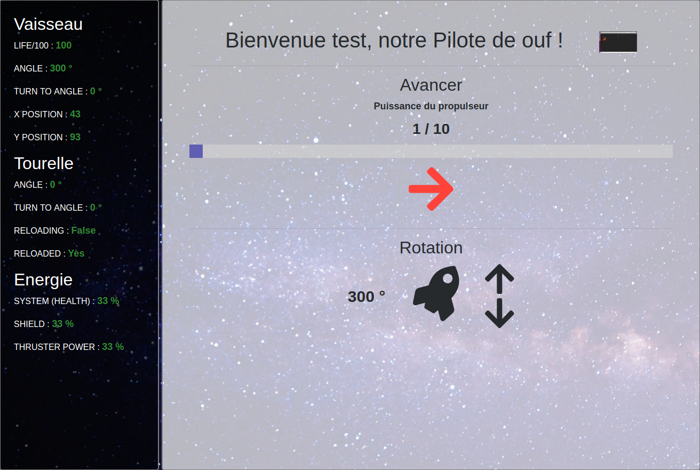

HTML5 Mars Project Contrôleurs
------------------------------

# Auteurs

CULIERAS Julien - BOUDIER Benjamin : Pilote
BENTO-PEREIRA David - BONIN Léo

# Description

## Pilote

Le dashboard du pilote est composé d'une interface d'information sur l'état du vaisseau (partie gauche) et un centre de commande du vaisseau (partie droite).

Vous pouvez augmenter les puissance des propulseurs (afin d'augmenter la vitesse du vaisseau) et vous avez, en tant que pilote, un contrôle sur la rotation et le déplacement du vaisseau.

Si vous préférez utiliser les touches de votre clavier afin de contrôler le vaisseau voici la liste des commandes disponibles :

* → : déplacer le vaisseau
* ↓ : rotation dans le sens horaire
* ↑ : rotation dans le sens anti-horaire
* "+" : Augmenter la puissance des propulseurs
* "-" : Diminuer la puissance des propulseurs

## Artilleur

Le dashboard de l'artilleur se compose d'une interface d'information sur l'état du vaisseau (partie gauche) et d'un centre de commande de la tourelle. Celui-ci se compose de deux panneaux :
- Le premier permet de contrôler la tourelle

- Le second permet de contrôler le tir de la tourelle
